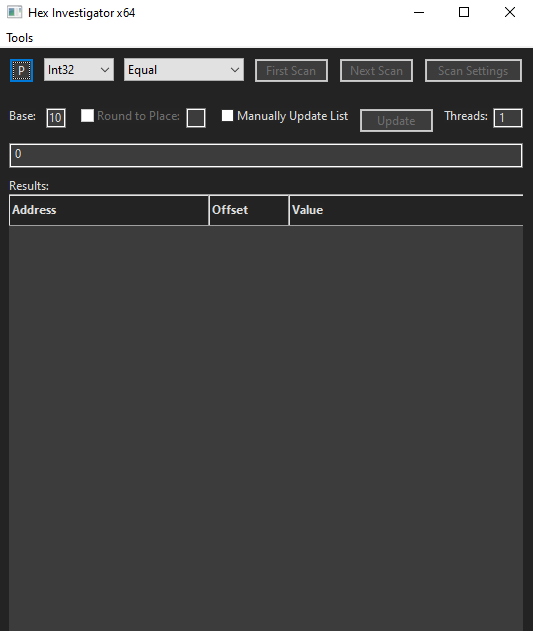

# Hex Investigator
Hex Investigator is a memory searcher for Windows. It uses the Windows API to access process memory for both reading and writing from user mode. Its primary use is to scan a process's memory for a specific value, but it also has other features. Using Hex Investigator, you can set hardware breakpoints, dissassemble machine code, scan for pointers, and more. 

# Installation
There is a precompiled executable in the build folder already. If you want, you can also build it yourself with Microsoft Visual Studio and wxWidgets installed.

# Usage
Once running, you will be able to use Hex Investigator through the GUI. Clicking on the "P" in the top left corner will allow you to select a process that is currently running and open a handle to it.

# Dependencies
GUI made using wxWidgets
https://www.wxwidgets.org/

Zydis amalgamated release used for disassembly
https://github.com/zyantific/zydis/releases
